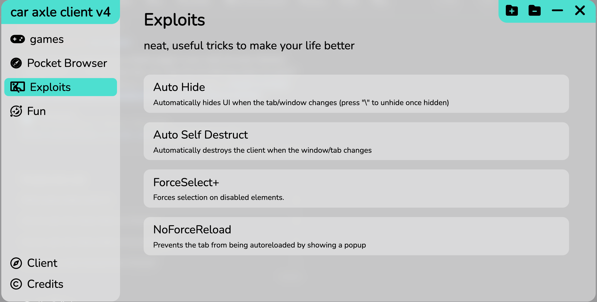

# car axle client
  

#### a bookmarklet with a good ui and some features
#### v1.0.0 will release on AUGUST 31ST
Built with typescript and less.
WARNING
This bookmarklet is only fully supported on chrome. Check out our [compatibility graph](https://github.com/car-axle-client/car-axle-client/blob/main/docs/compatibility.md) to see if your browser is supported.
## Features

- Many themes
- Save settings to a specific site
- Easily hide and show ui by pressing backslash
- Cross platform (as long as you are on chrome)
- Very clean ui
## Installation

### Website Installation
Install on the [website](https://car-axle-client.github.io)

### Manual Build/Editing
1. Clone this repo (i forgot the command so just look it up)
2. Install the required dependencies (package.json)
3. Make your edits
4. build with npx webpack
5. use a website such as Mrcoles bookmarklet generator to turn the output from `./build/index.js` into a bookmarklet
    
## Demo

Demo is avaiable on the [website](https://car-axle-client.github.io)

## Screenshots

Light Mode

Dark Mode

## Contributing

Contributions are always welcome!
(especially cleaning up code)

See `contributing.md` for ways to get started, or just look at the roadmap
## Roadmap

- the loaders. yes.

- Multi-browser support? if?

- Cleaning up the codebase

- Adding a proxy

- Adding more modules

- Optimizations

## Support

For support, contact me on discord @penguinify or through github issues

## Feedback

In the client, there is a button that sends feedback, idk what the link is.
